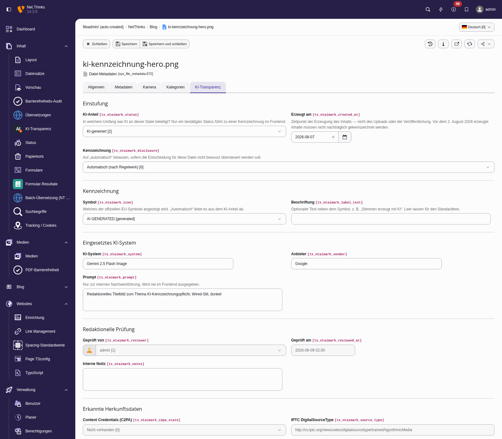

# Redaktionsleitfaden

Dieser Leitfaden richtet sich an Redakteurinnen und Redakteure. Er erklärt,
was im Reiter **KI-Transparenz** einzutragen ist — nicht, wie die
KI-Verordnung auszulegen ist. Im Zweifel entscheidet die verantwortliche
Person im Haus, nicht die Extension.

## Wo Sie den Reiter finden

*Medien* → Datei auswählen → *Metadaten bearbeiten* → Reiter
**KI-Transparenz**.

## Das Wichtigste in drei Sätzen

1. **KI-Anteil** ist das einzige Pflichtfeld — alles andere folgt daraus.
2. **Kennzeichnung** bleibt auf „Automatisch", solange Sie nicht bewusst
   übersteuern wollen.
3. Felder, die Sie nicht sehen, sind für Ihren Fall nicht relevant. Sie
   erscheinen nach dem Speichern, sobald der KI-Anteil sie erforderlich macht.

## Die Felder im Einzelnen

### KI-Anteil

| Auswahl | Wann |
|---|---|
| **Ungeprüft** | Startzustand. Niemand hat die Datei bisher angesehen. Es wird nichts gekennzeichnet. |
| **Kein KI-Einsatz** | Foto, Grafik oder Illustration ohne generative KI. |
| **KI-generiert** | Vollständig von einer KI erzeugt; menschlicher Anteil beschränkt sich auf den Prompt. |
| **KI-bearbeitet** | Mischform in beide Richtungen: KI-Bild nachbearbeitet oder echtes Foto mit KI verändert. |
| **Herkunft unbekannt** | Bestandsmaterial, bei dem sich nicht mehr klären lässt, wie es entstanden ist. |
| **Vorschlag — noch nicht bestätigt** | Von der automatischen Erkennung gesetzt. **Bestätigen Sie ihn oder korrigieren Sie ihn** — solange er auf „Vorschlag" steht, wird nichts gekennzeichnet. |

> Ein Vorschlag ist keine Feststellung. Die Aussage „dieser Inhalt ist
> KI-generiert" ist eine Behauptung über den Inhalt, und die trifft ein
> Mensch, nicht die Software.

### Erzeugt am

Der Zeitpunkt, zu dem der **Inhalt entstanden** ist — nicht der des Uploads
und nicht der der Veröffentlichung.

Das Feld steuert die Stichtagsregel: Inhalte, die vor dem **2. August 2026**
erzeugt wurden, müssen nicht nachträglich gekennzeichnet werden. Lassen Sie
das Feld leer, wenn Sie das Datum nicht kennen — ein leeres Feld führt
bewusst **nicht** zur Ausnahme, sonst würde ein unbekanntes Datum stillschweigend
von der Kennzeichnung befreien.

### Kennzeichnung

| Auswahl | Wirkung |
|---|---|
| **Automatisch** | Das Regelwerk entscheidet. Der Normalfall. |
| **Immer kennzeichnen** | Auch dann kennzeichnen, wenn die Regeln es nicht verlangen würden. |
| **Nicht kennzeichnen** | Sie haben den Fall geprüft und halten eine Kennzeichnung nicht für erforderlich. |

„Immer kennzeichnen" überstimmt weder den Stichtag noch „Kein KI-Einsatz"
noch einen ungeprüften Datensatz — es wirkt erst, wenn ohnehin ein Label
möglich wäre.

### Grund für die Nichtkennzeichnung

Erscheint, sobald Sie „Nicht kennzeichnen" wählen. Die Angabe wird
protokolliert und ist Ihre Dokumentation der Entscheidung.

| Grund | Gemeint ist |
|---|---|
| Vor dem 2. August 2026 erzeugt | Stichtagsregel |
| Offensichtlich unrealistisch oder comicartig | Keine täuschende Wirkung |
| Künstlerisches Werk / Satire / Fiktionales Werk | Reduzierte Pflicht, „in geeigneter Weise" |
| Rein interner Inhalt | Nicht öffentlich zugänglich |
| Reine Hilfsfunktion ohne wesentliche Änderung | Etwa Rechtschreibkorrektur |
| Sonstiges | Bitte in der internen Notiz erläutern |

### Symbol und Beschriftung

Erscheinen, sobald eine Kennzeichnung entstehen kann.

- **Symbol**: „Automatisch" leitet es aus dem KI-Anteil ab und ist meist
  richtig. „Kein Symbol" ist eine bewusste Entscheidung für eine reine
  Textkennzeichnung — sie wird respektiert und nicht überschrieben.
- **Beschriftung**: Freitext neben dem Symbol, etwa „Stimmen erzeugt mit KI".
  Leer lassen für den Standardtext.

### KI-System, Anbieter, Prompt

Erscheinen bei KI-Beteiligung oder bei einem Vorschlag.

- **KI-System** und **Anbieter** erscheinen in der aufklappbaren Detailebene
  im Frontend, z. B. „DALL·E 3 (OpenAI)".
- Der **Prompt** ist ausschließlich interne Nachweisführung. Er wird **nie**
  im Frontend ausgegeben.

### Geprüft von / Geprüft am

Werden von der Extension gesetzt, sobald ein Status bestätigt wurde. Sie
können sie nicht bearbeiten — das ist Absicht, es ist ein Nachweis.

### Erkannte Herkunftsdaten

Ergebnis der automatischen Auswertung beim Upload (C2PA-Signatur, IPTC-Angabe
zur digitalen Quelle). Nur zur Information, nicht bearbeitbar.

## Typische Fälle

| Situation | Eintrag |
|---|---|
| Stockfoto, ganz normal fotografiert | Kein KI-Einsatz |
| Mit Midjourney erzeugtes Headerbild, 2026 | KI-generiert · System „Midjourney" · Erzeugungsdatum |
| Foto, bei dem der Himmel mit KI ersetzt wurde | KI-bearbeitet |
| Foto, bei dem nur Helligkeit und Kontrast korrigiert wurden | Kein KI-Einsatz |
| Comicartige KI-Illustration ohne realistische Wirkung | KI-generiert · Nicht kennzeichnen · Grund „Offensichtlich unrealistisch" |
| Altes Archivbild von 2019 | Kein KI-Einsatz, Erzeugungsdatum eintragen |
| Bild aus dem Bestand, Herkunft nicht mehr klärbar | Herkunft unbekannt |

## Was die Extension nicht tut

- Sie erkennt **nicht**, ob ein fremdes Bild von einer KI stammt. Heuristische
  Detektoren sind unzuverlässig, und ein falsch positives Ergebnis wäre eine
  falsche Aussage über einen Inhalt.
- Sie trifft **nicht** die rechtliche Einordnung. Sie strukturiert Ihre
  Entscheidung und dokumentiert sie.
