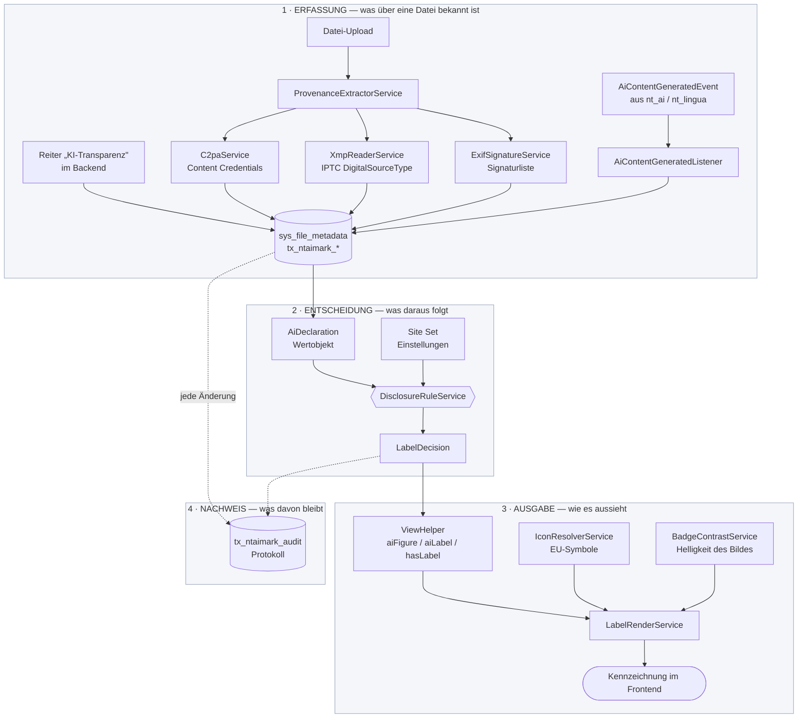
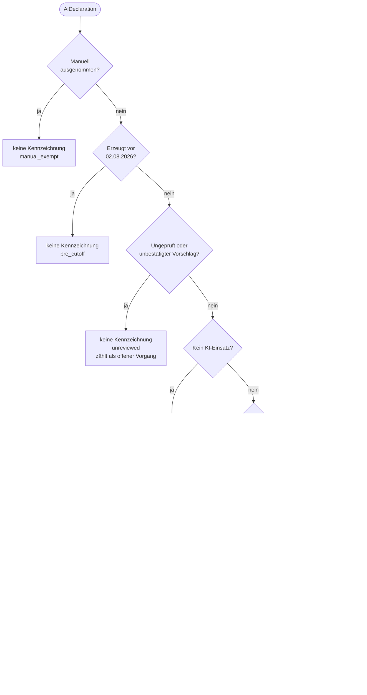
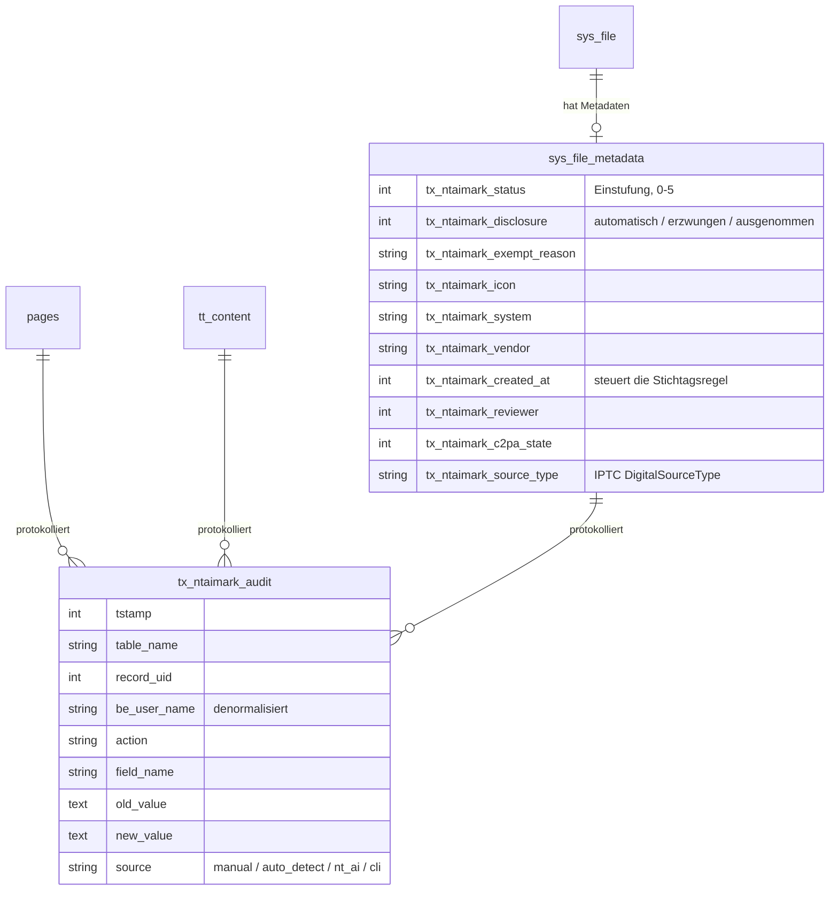
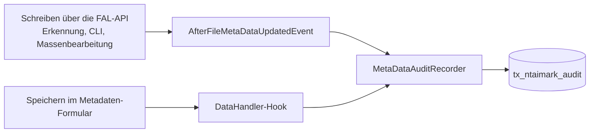
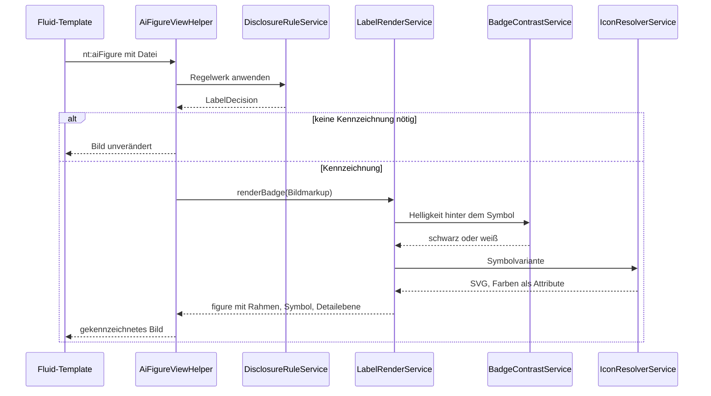
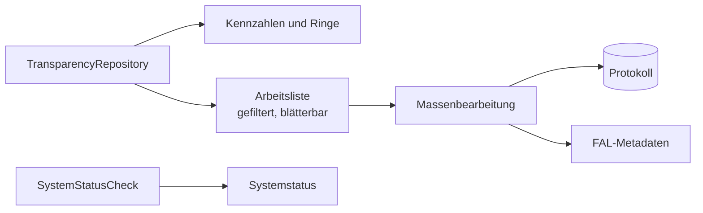
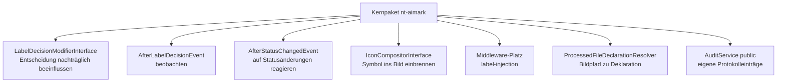

# Architektur

Diese Seite beschreibt, wie die Extension aufgebaut ist und wo eine
Entscheidung tatsächlich fällt. Sie richtet sich an alle, die den Ablauf
nachvollziehen oder daran andocken wollen — nicht nur an Entwickler.

## Der Grundgedanke

Die Extension trennt drei Dinge, die gern vermischt werden:

| Stufe | Frage | Was dort passiert |
|---|---|---|
| **1 Erfassung** | Was ist über eine Datei bekannt? | Metadatenfelder, automatische Erkennung, Meldungen anderer Extensions |
| **2 Entscheidung** | Was folgt daraus? | Eine einzige Klasse entscheidet, ob und wie gekennzeichnet wird |
| **3 Ausgabe** | Wie sieht das aus? | ViewHelper, Symbol, Detailebene |
| **4 Nachweis** | Was bleibt davon? | Jede Statusänderung im Protokoll, unabhängig vom Weg |

Diese vier Stufen sind auch die vier Kästen im folgenden Diagramm.

Diese Trennung ist der Grund, warum eine automatische Erkennung nie zu einer
Kennzeichnung führen kann, ohne dass ein Mensch zugestimmt hat: Erfassung und
Entscheidung sind verschiedene Schritte, und der Übergang zwischen ihnen ist
genau eine Statusänderung.

## Überblick

Gepunktete Linien sind Nachweisführung: Jede Statusänderung landet im
Protokoll, gleich über welchen Weg sie entstanden ist.

## Der Entscheidungsweg

Das Regelwerk arbeitet eine feste Reihenfolge ab. Die erste zutreffende Regel
gewinnt und hinterlässt einen maschinenlesbaren Begründungscode im Protokoll.

Zwei Punkte daran sind Absicht und keine Randnotiz:

**Regel 2 greift nur bei gesetztem Datum.** Ein leeres Erzeugungsdatum gilt
ausdrücklich **nicht** als „vor Stichtag". Sonst würde jeder unvollständige
Datensatz automatisch zur Ausnahme.

**Regel 3 steht vor allem Weiteren, was zu einer Kennzeichnung führen könnte.**
Ein Vorschlag aus der automatischen Erkennung erzeugt nie eine Kennzeichnung
im Frontend. Die Aussage „dieser Inhalt ist KI-erzeugt" ist eine rechtliche
Behauptung und braucht eine menschliche Freigabe.

## Wo die Daten liegen

Das Protokoll ist **append-only**: Die Anwendung schreibt nur hinzu, sie
ändert und löscht nichts. Der Benutzername wird mitgeschrieben statt nur
verwiesen, damit der Nachweis lesbar bleibt, wenn der Backend-Benutzer später
gelöscht wird.

Texte in `pages` und `tt_content` tragen eigene Felder
(`tx_ntaimark_text_status`, `tx_ntaimark_public_interest`,
`tx_ntaimark_editorial_control`, `tx_ntaimark_responsible`); weitere Tabellen
lassen sich in den Extension-Einstellungen nachrüsten.

## Zwei Wege, auf denen eine Änderung ins Protokoll kommt

Das ist die unauffälligste Stelle der Architektur und zugleich die, an der am
ehesten etwas verlorengeht.

Der PSR-14-Event feuert **nur** bei Schreibzugriffen über die FAL-API. Ein
Redakteur, der das Formular speichert, löst ihn nicht aus — TYPO3 v14 bietet
für Datensatzänderungen keinen entsprechenden Event. Deshalb der zusätzliche
DataHandler-Hook. Beide Wege münden in dieselbe Klasse, und der vorherige Wert
kommt aus dem Protokoll selbst; damit entsteht kein doppelter Eintrag, wenn
beide Wege denselben Vorgang sehen.

## Ausgabe im Frontend

Drei Entscheidungen, die man dem Ergebnis nicht ansieht:

**Der ViewHelper darf bedingungslos gesetzt werden.** Trifft das Regelwerk
keine Kennzeichnung, gibt er das Bild unverändert zurück. Redaktionen müssen
also nicht wissen, welche Bilder betroffen sind.

**Das Symbol steht in einem eigenen Rahmen um das Bild**, nicht in der
gesamten `figure`. Sonst würde es unterhalb des Bildes landen — und die
Kontrastentscheidung, die anhand der Bildhelligkeit fällt, ginge ins Leere.

**Das SVG trägt seine Farben als Attribute**, nicht in einem `<style>`-Block.
Eine Content Security Policy mit Nonce für `style-src-elem` — in TYPO3 v14 der
Standard — verwirft Inline-Stylesheets kommentarlos; das offizielle Symbol
würde sonst als schwarze Fläche erscheinen.

Fehlen die EU-Symbole ganz, entsteht ein Textlabel statt eines leeren
Elements. Siehe [Installation](installation.md).

## Backend-Modul

Das Repository nimmt automatisch erzeugte Formatvarianten
(`bild.jpg.webp`, `bild.jpg.avif`) aus allen Zählungen heraus — sie zeigen
denselben Inhalt wie das Original und würden Arbeitsliste wie Prüfquote
verzerren. Abschaltbar über die Einstellung `hideDerivedFormats`.

`SystemStatusCheck` prüft, was zur Laufzeit fehlen kann: EU-Symbole,
`c2patool`, die PHP-Erweiterung `exif` und eine GFX-Konfiguration, die
Metadaten zerstört.

## Erweiterungspunkte

Dieses Repository ist das freie Kernpaket. Zusatzfunktionen klinken sich über
definierte Punkte ein, ohne es zu patchen — und ohne jede Lizenz- oder
Freischaltlogik im Code.

Alle sind mit `@api` gekennzeichnet und in
[Integration](integration.md) im Einzelnen beschrieben.
