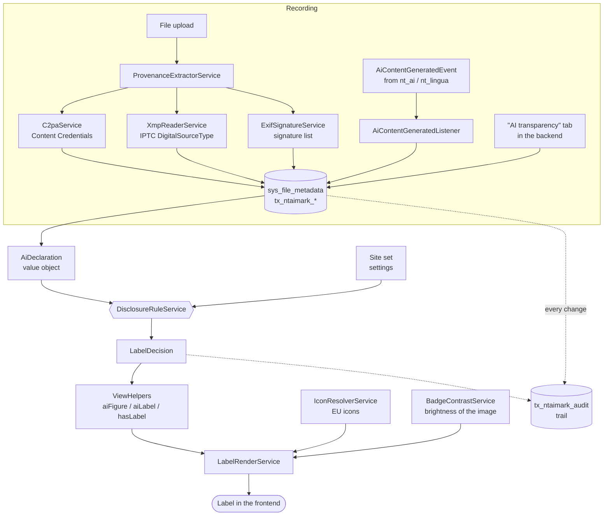
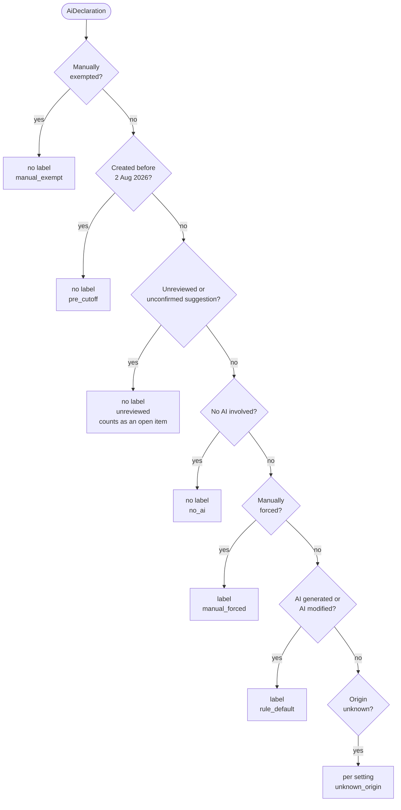
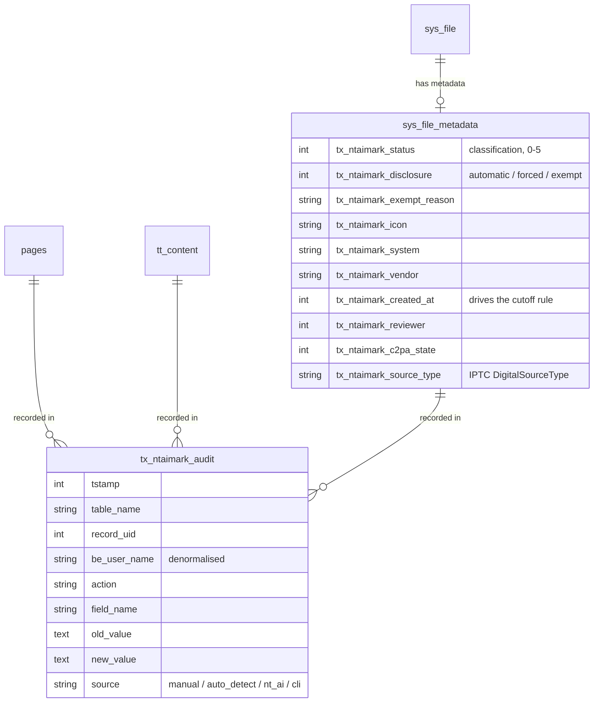
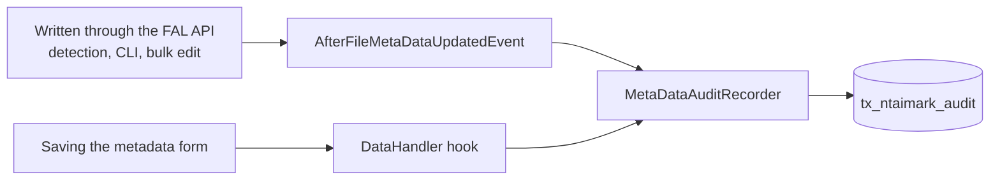
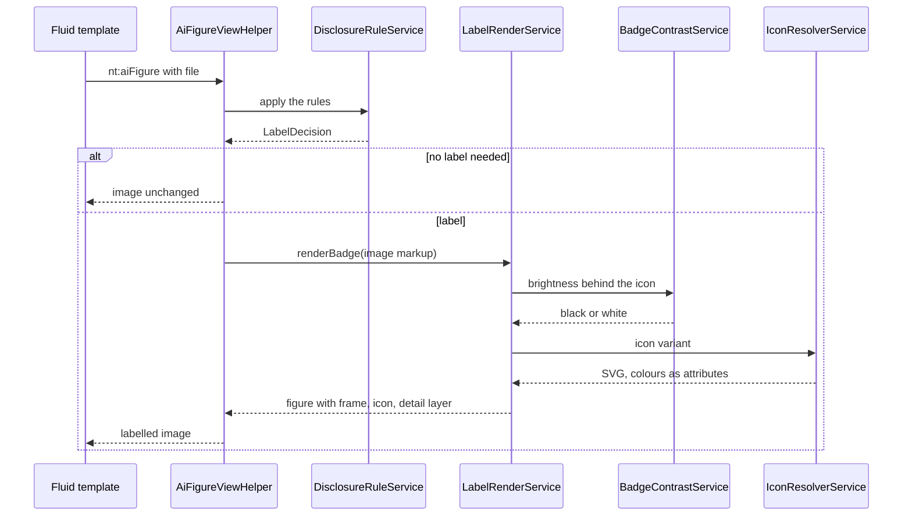
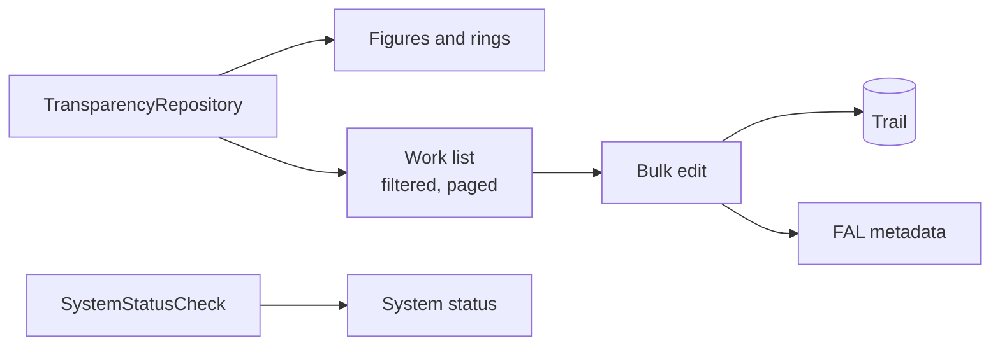
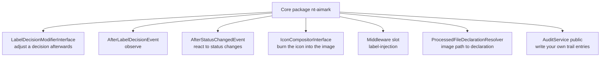

# Architecture

This page describes how the extension is put together and where a decision is
actually made. It is meant for anyone following the flow or hooking into it —
not only for developers.

## The underlying idea

The extension keeps three things apart that are easily conflated:

| | |
|---|---|
| **What is known about a file?** | Recording — metadata fields, automatic detection, reports from sibling extensions |
| **What follows from it?** | Rules — a single class decides whether and how to label |
| **What does it look like?** | Output — ViewHelpers, icon, detail layer |

That separation is why automatic detection can never produce a label without a
person agreeing to it: recording and deciding are different steps, and the
transition between them is exactly one status change.

## Overview

Dotted lines are evidence: every status change lands in the trail, whichever
route produced it.

## The decision path

The rules work through a fixed order. The first rule that applies wins and
leaves a machine-readable reason code in the trail.

Two things about it are deliberate rather than incidental:

**Rule 2 only applies with a date set.** An empty creation date explicitly does
**not** count as "before the cutoff". Otherwise every incomplete record would
turn itself into an exemption.

**Rule 3 comes before anything that could produce a label.** A suggestion from
automatic detection never renders a label in the frontend. "This content is AI
generated" is a legal assertion and needs a human to release it.

## Where the data lives

The trail is **append-only**: the application adds to it and never changes or
deletes anything. The user name is written along rather than referenced, so
the record stays readable once the backend user is deleted.

Text in `pages` and `tt_content` carries its own fields
(`tx_ntaimark_text_status`, `tx_ntaimark_public_interest`,
`tx_ntaimark_editorial_control`, `tx_ntaimark_responsible`); further tables can
be added in the extension settings.

## Two routes by which a change reaches the trail

This is the least conspicuous part of the architecture and the one where
something is most likely to go missing.

The PSR-14 event fires **only** for writes through the FAL API. An editor
saving the form does not trigger it — TYPO3 v14 offers no comparable event for
record updates, hence the additional DataHandler hook. Both routes end in the
same class, and the previous value comes from the trail itself, so nothing is
recorded twice when both routes see the same change.

## Frontend output

Three decisions the result does not show:

**The ViewHelper can be set unconditionally.** Where the rules produce no
label, it returns the image untouched — editors need not know which images are
affected.

**The icon sits in a frame of its own around the picture**, not in the whole
`figure`. Otherwise it would come to rest below the image, and the contrast
decision made from the image's brightness would apply to something else.

**The SVG carries its colours as attributes**, not in a `<style>` block. A
Content Security Policy with a nonce for `style-src-elem` — the default in
TYPO3 v14 — drops inline stylesheets without a word, and the official icon
would render as a solid black shape.

With the EU icons missing entirely, a text label appears instead of an empty
element. See [Installation](installation.md).

## Backend module

The repository keeps automatically produced format variants
(`photo.jpg.webp`, `photo.jpg.avif`) out of every count — they show the same
picture as the original and would distort both the work list and the reviewed
percentage. Switchable via the `hideDerivedFormats` setting.

`SystemStatusCheck` reports what can be missing at runtime: EU icons,
`c2patool`, the `exif` PHP extension, and a GFX configuration that destroys
metadata.

## Extension points

This repository is the free core package. Additional features hook in through
defined points without patching it — and without any licence or activation
logic in the code.

All are marked `@api` and described individually in
[Integration](integration.md).
