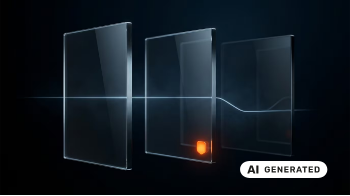
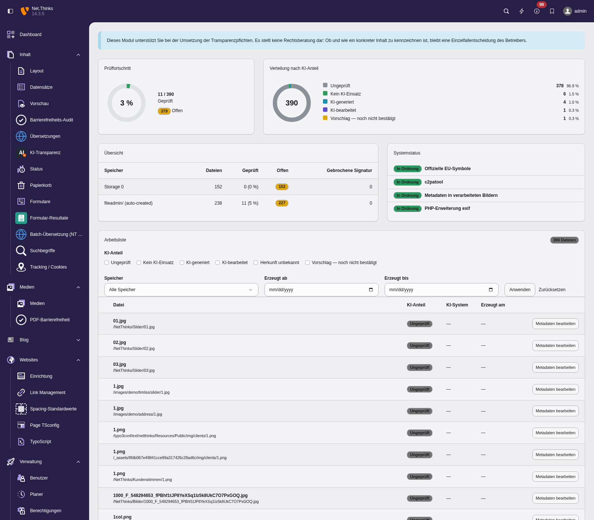

# AI Mark — KI-Kennzeichnung für TYPO3

Erfassen, kennzeichnen und dokumentieren Sie KI-generierte Inhalte in TYPO3 —
passend zu den Transparenzpflichten aus Art. 50 der EU-KI-Verordnung
(VO (EU) 2024/1689), die seit dem 2. August 2026 gelten.

!!! warning "Kein Rechtsrat"
    Diese Extension ist ein technisches Hilfsmittel. Sie unterstützt bei der
    Umsetzung und stellt keine Rechtsberatung dar. Ob und wie ein konkreter
    Inhalt zu kennzeichnen ist, bleibt eine Einzelfallentscheidung des
    Betreibers.

## Was die Extension macht

**Erfassen** — eigener Reiter „KI-Transparenz" in den Dateimetadaten:
KI-Anteil, eingesetztes System, Erzeugungsdatum, verantwortliche Person. Für
Texte entsprechende Felder auf Seiten, Inhaltselementen und nachrüstbaren
Zusatztabellen.

**Automatisch vorschlagen** — beim Upload werden vorhandene Herkunftsdaten
ausgelesen: C2PA-Signatur, IPTC `DigitalSourceType` aus XMP, zuletzt eine
Signaturliste über EXIF-Felder. Die Bestätigung bleibt beim Menschen.

**Kennzeichnen** — barrierefreie Ausgabe im Frontend mit den offiziellen
EU-Symbolen, inklusive aufklappbarer Detailebene. Für Texte ein Satz statt
eines Symbols.



**Nachweisen** — Backend-Modul mit Übersicht über geprüfte und offene Dateien
sowie ein Protokoll aller Statusänderungen.



## Was sie ausdrücklich nicht macht

- **Keine Erkennung fremder KI-Inhalte.** Heuristische Detektoren sind
  unzuverlässig; ein falsch positives Ergebnis wäre eine falsche Aussage über
  einen Inhalt.
- **Keine Kennzeichnung ohne menschliche Bestätigung.** Ein automatischer
  Fund ist immer nur ein Vorschlag. „Dieser Inhalt ist KI-generiert" ist eine
  Behauptung, und die trifft ein Mensch.
- **Keine Garantie der Rechtskonformität.** Für die Bewertung des Einzelfalls
  ziehen Sie bitte rechtlichen Rat hinzu.

## Voraussetzungen

| | |
|---|---|
| TYPO3 | 13.4 LTS, 14 LTS |
| PHP | 8.2 – 8.4 |
| Optional | `c2patool` für Content Credentials |

## Schnellstart

```bash
composer require netthinks/nt-aimark
vendor/bin/typo3 extension:setup
```

Danach das Site Set `AI Mark` einbinden — siehe [Installation](installation.md).

## Teil der NET.THINKS KI-Suite

| Extension | Zweck |
|---|---|
| `nt_ai` | KI-Anbindung: Alt-Texte, Barrierefreiheits-Audits |
| `nt_lingua` | Übersetzung, Einfache Sprache, l10n-Overlays |
| **`nt_aimark`** | KI-Transparenz und Kennzeichnung |

Sind `nt_ai` oder `nt_lingua` installiert, können sie ihre Erzeugnisse melden
— siehe [Integration](integration.md).

## Wer dahintersteht

`nt_aimark` entsteht bei **NET.THINKS**, einer TYPO3-Agentur aus
Villingen-Schwenningen. Das Kernpaket ist frei (GPL-2.0-or-later) und
vollständig — es ist kein Probeexemplar von etwas Größerem.

Darüber hinaus gibt es zwei Dinge, die manche brauchen und viele nicht:

**Das Zusatzpaket `nt_aimark_pro`** klinkt sich über die dokumentierten
[Erweiterungspunkte](integration.md) ein und bringt Funktionen, die im freien
Paket bewusst fehlen, weil sie nicht jeder braucht: das Einbrennen des Symbols
in die Bilddatei, Nachbearbeitung des fertigen HTML für gewachsene Templates,
Auswertung und Export des Protokolls, eine Transparenzerklärung und die
Anbindung an einen gehosteten Prüfdienst für Content Credentials.

**Unterstützung bei der Umsetzung** — Bestandsaufnahme, Einordnung der
Inhalte, Einrichtung. Wer die Extension selbst einrichten will, findet in
dieser Dokumentation alles Nötige; das ist ausdrücklich der Regelfall.

- Website: <https://www.netthinks.com/leistungen/websites/ki-kennzeichnung-typo3/>
- Fragen, Fehler, Wünsche: <https://github.com/netthinks/nt_aimark/issues>
