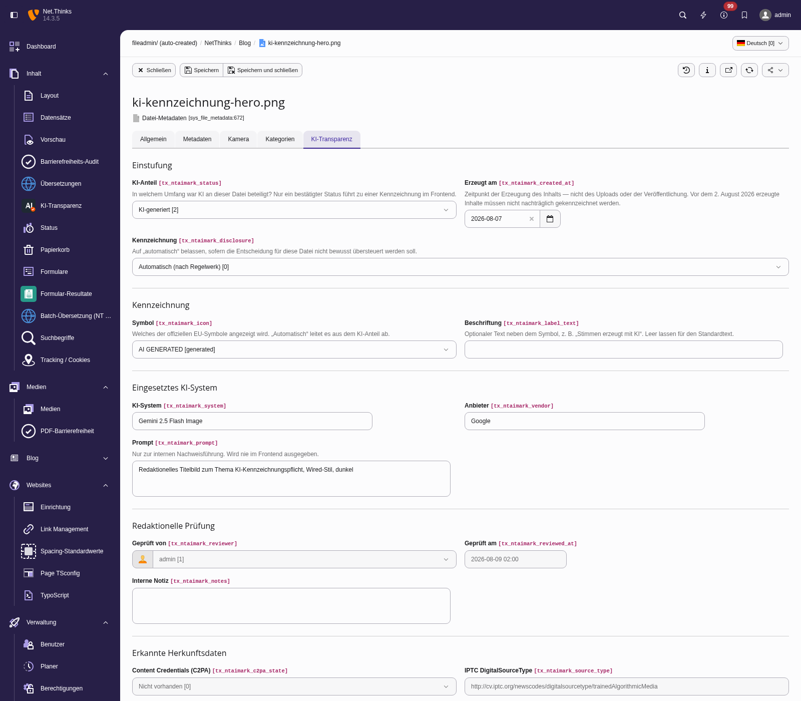
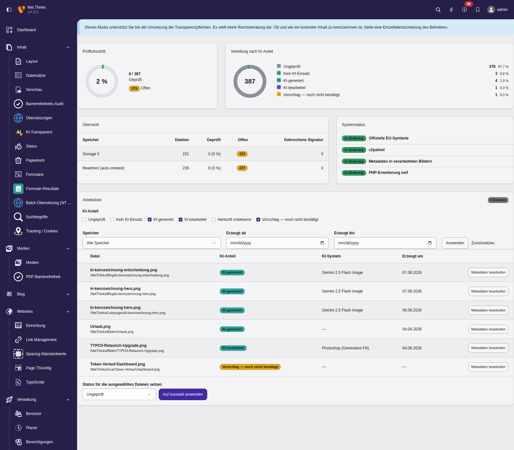

# Editorial guide

This guide is for editors. It explains what to fill in on the **AI
transparency** tab — not how to interpret the AI Act. When in doubt, the
person responsible in your organisation decides, not the extension.

## Where to find the tab

*Media* → select a file → *Edit metadata* → tab **AI transparency**.

For texts the same tab appears on pages and content elements.

## The essentials in three sentences

1. **AI involvement** is the only field you have to set — everything else
   follows from it.
2. **Labelling** stays on "Automatic" unless you deliberately want to override
   the decision.
3. Fields you cannot see are not relevant to your case. They appear after
   saving, once the AI involvement calls for them.

## The "AI transparency" module

*Content* → **AI transparency**. The module answers two questions: how far the
review has come, and what is up next.

The work list can be filtered by AI involvement, storage and creation period.
Several files can be classified at once — each one gets its own trail entry.

A **suggestion** comes from automatic detection and is not yet a finding: it
produces no label in the frontend and waits for you to confirm it.

## The fields for media

### AI involvement

| Choice | When |
|---|---|
| **Not reviewed** | Starting state. Nobody has looked at the file. Nothing is labelled. |
| **No AI involved** | A photo, graphic or illustration without generative AI. |
| **AI generated** | Produced entirely by an AI; the human part was the prompt. |
| **AI modified** | Mixed in either direction: an AI image reworked, or a real photo altered with AI. |
| **Origin unknown** | Stock material where it can no longer be established how it came about. |
| **Suggestion — not confirmed** | Set by automatic detection. **Confirm it or correct it** — while it says "Suggestion", nothing is labelled. |

!!! note "A suggestion is not a finding"
    Saying "this content is AI generated" is a claim about the content, and a
    person makes it, not the software.

### Created on

The moment the **content was created** — not the upload, and not the
publication.

This drives the cutoff rule: content created before **2 August 2026** does not
have to be labelled retroactively. Leave the field empty if you do not know
the date — an empty field deliberately does **not** create an exemption, since
an unknown date would otherwise quietly excuse the file.

### Labelling

| Choice | Effect |
|---|---|
| **Automatic** | The rules decide. The normal case. |
| **Always label** | Label even where the rules would not require it. |
| **Do not label** | You have assessed the case and consider a label unnecessary. |

"Always label" overrides neither the cutoff, nor "No AI involved", nor an
unreviewed record — it takes effect only where a label would be possible
anyway.

### Reason for not labelling

Appears as soon as you choose "Do not label". The entry is recorded and is
your documentation of the decision.

| Reason | Means |
|---|---|
| Created before 2 August 2026 | Cutoff rule |
| Obviously unrealistic or cartoon-like | No deceptive effect |
| Artistic work / Satire / Fictional work | Reduced obligation, "in an appropriate manner" |
| Internal content only | Not publicly available |
| Assistive editing without substantial change | Spell checking, for instance |
| Other | Please explain in the internal note |

### Icon and label text

Appear as soon as a label could result.

- **Icon**: "Automatic" derives it from the AI involvement and is usually
  right. "No icon" is a deliberate choice for a text-only label — it is
  respected and not overruled.
- **Label text**: optional wording next to the icon, e.g. "Voices generated
  with AI". Leave empty for the default.

### AI system, vendor, prompt

Appear where AI was involved, or where there is a suggestion.

- **AI system** and **vendor** show up in the expandable detail panel in the
  frontend, e.g. "DALL·E 3 (OpenAI)".
- The **prompt** is internal documentation only. It is **never** rendered in
  the frontend.

### Reviewed by / Reviewed on

Set by the extension once a status has been confirmed. You cannot edit them —
that is intentional, they are evidence.

### Detected provenance data

The result of the automatic inspection on upload (C2PA signature, IPTC digital
source type). Information only, not editable.

## The fields for texts

### AI involvement in the text

No AI involved · AI draft, revised by a human · AI generated.

### Matter of public interest

The obligation for texts only covers matters of public interest, not every
text. Everything else stays switched off until you tick this.

### Reviewed by a human, and the responsible person

Editorial review lifts the obligation — **but only together with the person
answering for it**. A tick box with no name documents nothing, so the text
keeps its notice until somebody is named. That is why the field is required as
soon as the box is ticked.

## Typical cases

| Situation | Entry |
|---|---|
| An ordinary stock photograph | No AI involved |
| A header image made with Midjourney, 2026 | AI generated · system "Midjourney" · creation date |
| A photo whose sky was replaced with AI | AI modified |
| A photo with only brightness and contrast corrected | No AI involved |
| A cartoon-like AI illustration with no realistic effect | AI generated · Do not label · reason "Obviously unrealistic" |
| An archive picture from 2019 | No AI involved, enter the creation date |
| Stock material whose origin cannot be established | Origin unknown |
| A press release drafted by AI and edited by the newsroom | AI draft, revised · public interest · reviewed, with a name |

## What the extension does not do

- It does **not** detect whether a foreign image came from an AI. Heuristic
  detectors are unreliable, and a false positive would be a false statement
  about a piece of content.
- It does **not** make the legal assessment. It structures your decision and
  documents it.
